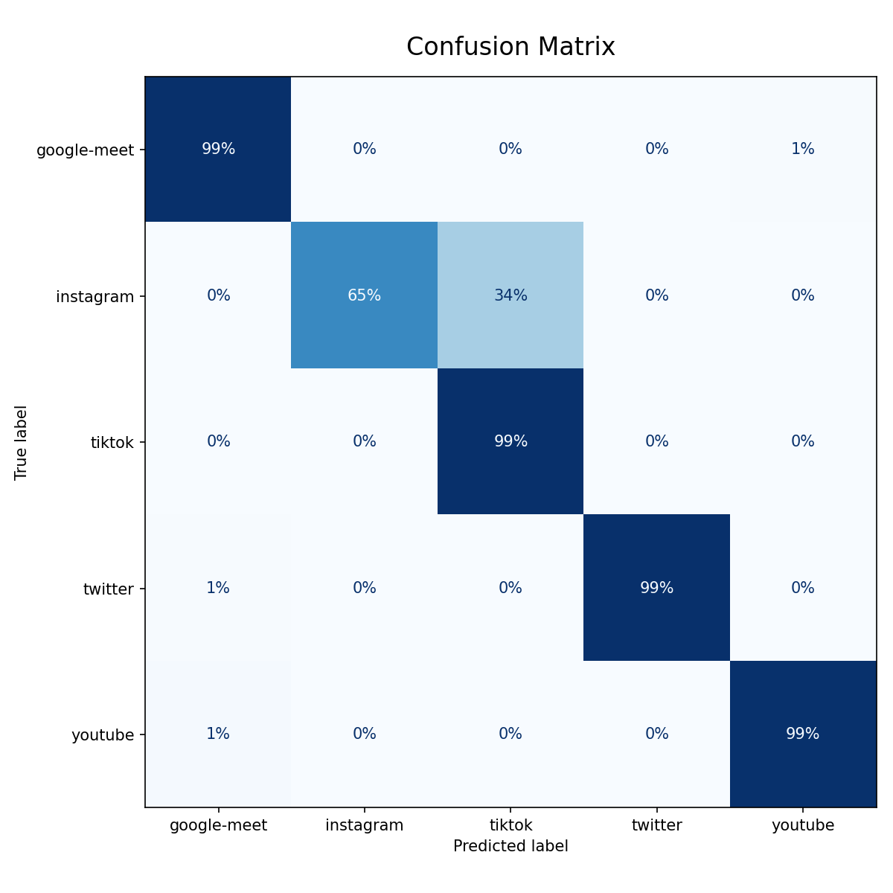

# Encrypted Packet Classifier

Scripts to train and evaluate a Resnet-50 based neural network to classify encrypted network packets. Exports to both Pytorch/.pth and ONNX.

Intended for use [here](https://github.com/Anthony-de-cruz/Packet-Forwarding-Service).

Currently setup for CPU based execution; additional work is required for CUDA execution. As a result, we are only training 5 epochs. Training/Testing data currently not included.



## Setup & Execution

### Via [uv](https://docs.astral.sh/uv/) (Recommended)

```sh
uv sync
uv run train.py && uv run test.py
```

### Native

Unix:

```sh
python -m venv .venv
source .venv/bin/activate
pip install -r requirements.txt
python train.py && python test.py
```

Windows:

```ps1
python -m venv .venv
.venv\Scripts\activate
pip install -r requirements.txt
python train.py && python test.py
```
